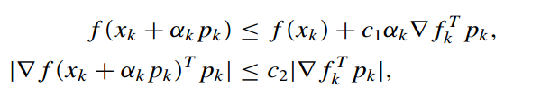

# 优化算法实现报告

* Author: lvwenlong_lambda@qq.com


## 1. project 简介 

这个 project 是杜建洪老师课程中介绍的优化算法的 c++ 实现。实现了如下算法：
* 各种一维查找算法，如斐波那契法、黄金分割法、外推法
* 基于 strong wolfe condition 的不精确线搜索方法
* 梯度下降法(Gradient Descent Method)
* 共轭梯度法(Conjugate Gradient Method)
* 牛顿法(Newton's Method)
* 拟牛顿法法(Quasi Newton Method), 包括 BFGS 算法与 DFP 算法。
* 单纯形法(Simplex Method)
* 鲍威尔法(Powell's Method)

## 2. 编译与构建

这个project使用**CMake**来管理，使用者需要在系统中事先安装CMake，程序是在ubuntu操作系统下编写与测试，CMake也可以生成Windows下Visual Studio的工程文件，具体的使用请参考CMake手册。

使用者可以使用如下方式来编译：

```bash
cd /path/to/this/project/src
mkdir out_build
cd out_build
cmake ..
make
cd ..
```

在运行`cmake ..`命令时，可以通过下列的两个命令行选项来控制程序的行为：
* `-DWRITE_LOG=ON/OFF`, 是否在优化时对每个点进行记录，如果为`OFF`则只记录最终的最优点
* `-DDEBUG_OPTIMIZER=ON/OFF`, 是否开启debug模式，如果为`ON`,则会使用统一的随机数发生器种子，这样保证每次运行，都得到相同的结果。

许多算法都需要矩阵运算，在 project 中，矩阵运算调用[Eigen](http://eigen.tuxfamily.org/index.php?title=Main_Page)实现

## 3. 基本数据结构

这个 project 关注的重点在算法运行的迭代次数。因此，并没对算法运行时采用的数据结构进行优化。

用来表示函数输入参数、函数返回结果、以及待优化函数的数据类型定义如下：

```cpp
// 优化函数输入参数向量
typedef std::vector<double> Paras;
// 优化函数执行结果
class Solution { // Para与evaluated result放在一个class中，方便(partial) sort
    Paras _solution;
    std::vector<double> _violation;  // sum of constraint violation
    double _fom;

    public:
    Solution(const Paras& s, const std::vector<double>& cv, double fom) noexcept;
    Solution() =delete;
    double fom() const noexcept;
    double sum_violation() const noexcept;
    const std::vector<double>& violations() const noexcept;
    const Paras& solution() const noexcept;
    Solution& operator=(const Solution&) =default;
    bool operator<(const Solution& s) const noexcept { return _fom < s.fom(); }
    bool operator<=(const Solution& s) const noexcept { return _fom <= s.fom(); }
};
typedef std::function<Solution(const Paras&)> ObjFunc;
```

使用`std::vector<double>`来表示待优化函数的输入参数，并将其`typedef`为`Paras`。

将输入参数、目标函数的值fom, 以及约束violation打包成一个class `Solution`, 这样会带来额外的拷贝开销，但好处是编程时更加方便，比如，可以很方便的对一组函数的解进行
排序，选出最好或者最差的解，如果把输入参数跟目标函数输出分开存储，则如果要对目标函数的解进行排序，则需要额外处理输入参数与目标函数输出的同步问题。

对于目标函数的表示，我采用了c\+\+11中函数式编程的特性。在c\+\+11中，可以用 lambda expression 来表示一个函数，这样表示的函数可以作为数据处理，可以作为另一个函数的输入参
数，也可以作为一个函数的返回值。在这个 project 中，目标函数表示为一个输入为`const Paras&`，输出类型为`Solution`的函数。这个函数由用户定义，并作为 optimizer 的构造
函数的一个参数。

## 4. 一维优化算法

一维函数优化是优化算法的基本，即使是多元函数, 在确定了下一步搜索方向之后，也往往在搜索方向上进行线搜索(line search)，在这个 project 中，实现了 Fibonacci 法, 黄金分割
法和外推内插法这三个优化算法。

首先定义一维函数优化的基类:

```cpp
class Optimizer1D
{
    protected:
        ObjFunc _func;

    public:
        Optimizer1D(ObjFunc func) noexcept : _func(func) {}
        virtual Solution optimize() noexcept = 0;
};
```

`Optimizer1D` 的构造函数接受一个 `ObjFunc` 类型，`ObjFunc` 即上一节介绍过的表示目标函数的类型，这里的目标函数必须是一维函数，否则，程序可能会出错。

`Optimizer1D::optimize()`是一个纯虚类，所有继承 `Optimizer1D` 类的派生类都需要实现这个方法，具体的一维优化算法就实现在这里。

### 4.1 Fibonacci 法

Fibonacci 法的类型声明如下:

```cpp
class FibOptimizer : public Optimizer1D
{
    const double _lb;
    const double _ub;
    const size_t _iter;

    public:
    FibOptimizer(ObjFunc f, double lb, double ub, size_t iter = 16) noexcept;
    Solution optimize() noexcept;
    ~FibOptimizer() {}
};
```
Fibonacci 法需要提供一个一维目标函数，同时，需要提供搜索的下界与上界，Fibonacci最终的精度随迭代次数指数下降，因此还需要提供一个迭代次数，设置迭代次数默认为16。

Fibonacci 法实现代码如下:

```cpp
Solution FibOptimizer::optimize() noexcept
{
    // 1-D function
    double a1 = _lb;
    double a2 = _ub;
    if (a1 > a2)
    {
        cerr << "Range error" << endl;
        exit(EXIT_FAILURE);
    }

    vector<double> fib_list{1, 1};
    if (_iter > 2)
    {
        for (size_t i = 2; i < _iter + 1; ++i) 
            fib_list.push_back(fib_list[i - 1] + fib_list[i - 2]);
    }

    double y1, y2;
    for(size_t i = 0; i < _iter - 1; ++i)
    {
        const double rate = fib_list[_iter - 1 - i] / fib_list[_iter - i];
        const double a3   = a2 - rate * (a2 - a1);
        const double a4   = a1 + rate * (a2 - a1);
        const double y3   = _func({a3}).fom();
        const double y4   = _func({a4}).fom();

        if (y3 < y4)
        {
            a2 = a4;
            y2 = y4;
        }
        else
        {
            a1 = a3;
            y1 = y3;
        }
    }
    return _func({a1});
}
```

Fibonacci 的基本思路是，希望在区间 [a1, a2] 内寻找函数 f 的最小值，则在 [a1, a2] 内找两个点 a3 与 a4 ，分别计算 y3 = f(a3) 与 y4 = f(a4) ，比较 y3 与 y4 的值，若 y3 < y4, 则说明最小值在 [a1, a4]区间内，若 y3 > y4, 则说明最小值在 [a3, a2]区间内，然后依此递归。

Fibonacci 法靠 Fibonacci 数列来确定 a3 与 a4 的值，因为迭代次数 `_iter` 已经确定，因此可以事先计算出从0到`_iter` Fibonacci 数列，对于第`i`次迭代（从0开始），计算 `rate = fib_list[_iter - 1 - i] / fib_list[_iter - i]`, 然后，令`a3   = a2 - rate * (a2 - a1)`, 令`a4   = a1 + rate * (a2 - a1)`


### 4.2 黄金分割法

黄金分割法的类型声明如下, 其类型声明以与 Fibonacci 法一致。

```cpp
class GoldenSelection : public Optimizer1D
{
    const double _lb;
    const double _ub;
    const size_t _iter;

    public:
    GoldenSelection(ObjFunc f, double lb, double ub, size_t iter = 16) noexcept;
    Solution optimize() noexcept;
    ~GoldenSelection() {}
};
```

黄金分割法的优化算法实现如下，它的思路与 Fibonacci 法一致，不同的是它使用黄金分割数0.618作为固定的区间收缩比例。

```cpp
Solution GoldenSelection::optimize() noexcept
{
    // 1-D function
    // function shoulde be convex function
    double a1 = _lb;
    double a2 = _ub;
    if (a1 > a2)
    {
        cerr << "Range error" << endl;
        exit(EXIT_FAILURE);
    }

    const double rate = (sqrt(5) - 1) / 2;
    double y1, y2;
    for (size_t i = _iter - 1; i > 0; --i)
    {
        const double interv_len = a2 - a1;
        const double a3 = a2 - rate * interv_len;
        const double a4 = a1 + rate * interv_len;
        if (a3 == a4)
            break;
        else
        {
            assert(a3 < a4);
            const double y3 = _func({a3}).fom();
            const double y4 = _func({a4}).fom();
            if (y3 < y4)
            {
                a2 = a4;
                y2 = y4;
            }
            else
            {
                a1 = a3;
                y1 = y3;
            }
        }
    }
    return y1 < y2 ? _func({a1}) : _func({a2});
}
```

### 4.3 外推内插法


黄金分割法与 Fibonacci 法都需要事先知道最优点的范围，而 Extrapolation 法则可以适用于最优点范围不知道的情况，它先寻找一个最优点的范围，然后再去调用其他优化算法，比如黄金分隔法或二次插值法在找到的范围内进行优化。

下面是外推内插法的类声明以及算法实现：

```cpp
class Extrapolation : public Optimizer1D
{
    const Paras  _init;
    const double _min_len;  // min extrapolation step
    const double _max_len;  // max extrapolation step
    public:
    Extrapolation(ObjFunc f, Paras i, double min_len, double max_len) noexcept;
    Solution optimize() noexcept;
    ~Extrapolation() {}
};

Solution Extrapolation::optimize() noexcept
{
    // 1-D function
    double step = _min_len;
    double x1 = _init[0];
    double x2 = x1 + step;
    double y1 = _func({x1}).fom();
    double y2 = _func({x2}).fom();

    double lb = x1;
    double ub = x1 + _max_len;
    if (y2 > y1)
    {
        step *= -1;
        ub = x1 - _min_len;
        lb = x1 - _max_len;
        x2 = x1 + step;
        y2 = _func({x2}).fom();
        if (y2 > y1) return _func({x1});
    }
    double factor = 2;
    double x3 = x2 + factor * step;
    double y3 = _func({x3}).fom();
    double xa, xc;
    double ya, yc;
    if (y3 > y2)
    {
        xa = x1;
        xc = x3;
        ya = y1;
        yc = y3;
    }
    else
    {
        while (y3 < y2 && (lb < x3 && x3 < ub))
        {
            factor *= 2;
            x3 += factor * step;
            if (x3 >= ub) x3 = ub;
            if (x3 <= lb) x3 = lb;
            y3 = _func({x3}).fom();
        }
        double xtmp1 = x3 - factor * step;
        double xtmp2 = x3 - (factor / 2) * step;
        double ytmp1 = _func({xtmp1}).fom();
        double ytmp2 = _func({xtmp2}).fom();
        if (ytmp1 < ytmp2)
        {
            xa = x2;
            xc = xtmp2;
            ya = y2;
            yc = ytmp2;
        }
        else
        {
            xa = xtmp1;
            xc = x3;
            ya = ytmp1;
            yc = y3;
        }
    }

    if (xa > xc)
    {
        std::swap(xa, xc);
        std::swap(ya, yc);
    }
    const double len = xc - xa;
    const size_t gso_iter = 2 + (log10(_min_len / len) / log10(0.618));
    return GoldenSelection(_func, xa, xc, gso_iter).optimize();
}
```
## 5. 不精确线搜索 

上一节实现的一维优化算法，都是期望找到在搜索方向上的最优点。但是，很多时候，找到严格意义上的最优点，往往需要很多次迭代; 而且, 因为搜索方向上的最优点并不是多元函数的最优点，在多元函数优化过程中，找到搜索方向上的最优点也没有必要。只要保证步长使得函数在搜索方向上下降足够多就可以了。因此，在实际的多元函数优化中，当需要确定在搜索方向上的步长时，常常并不采用精确的一元函数优化算法，而是规定一个“在搜索方向上足够下降”的标准，然后只要找到满足这样标准的点即可。


Strong wolfe Condition 是一个常用的不精确线搜索的判据，其判据如下：



在上式中，c1 与 c2 满足 `0 < c1 < c2 < 1`, 其中，第一个不等式被称作 sufficient decrease condition，第二个不等式被称作 curvature condition。如果步长满足 sufficient decrease condition, 则说明在步长处，函数已经有了足够的下降，而 curvature condition 则是要求函数在搜索方向上的梯度也有足够大的下降，因为很显然，如果在步长处函数的梯度仍然很大，则说明在这个方向上仍有进一步改变步长的余地。

下图是 strong wolfe condition 的一个例子，对于图中一维函数，只要最终步长选在位于 "acceptable" 的区间内即可。:


本次 project 实现了寻找满足 strong wolfe condition 的搜索步长的算法，其基本思路是，先通过插值与外推的方法，尝试一系列递增的 trial step，找到一个满足 strong wolfe condition 的区间。再在这个区间内，进行二次或三次插值，直到找到满蓄 strong wolfe condition 的步长。

Strong wolfe condition 寻找算法代码，可以去 src/Optimizer/StrongWolfe.cpp 中查看。


## 6. 多维函数优化

首先定义了两个基类, `MultiDimOptimizer` 与 `GradientMethod`，其中，`MultiDimOptimizer` 是一切多元函数优化算法的基类，在其中定义了一些辅助性质的成员变量与函数，如函数唯独、最大迭代次数，最大与最小步长等。

`GradientMethod`是`MultiDimOptimizer`的一个派生类，它是所有基于梯度法的Optimizer的基类，包括梯度下降法、共轭梯度法、牛顿法和拟牛顿法。在其中定义了一些与梯度有关的变量与函数，如求梯度的函数`GradientMethod::get_gradient`，求Hessian矩阵的函数`GradientMethod::hessian`，这两个函数都是虚函数，可以被派生类重载。`MultiDimOptimizer`中还定义了一些与梯度相关的成员变量，如用数值法求梯度时用到的`_epsilon`。以及判定收敛（梯度为零）的最小梯度等。

```cpp
class MultiDimOptimizer
{
protected:
    const size_t      _dim;
    const size_t      _max_iter;
    const double      _min_walk;
    const double      _max_walk;
    const std::string _func_name;
    const std::string _algo_name;
    std::ofstream     _log;

    virtual Solution run_func(const Paras&) noexcept;
    virtual Solution run_line_search(const Solution& s, const Eigen::VectorXd& direction) noexcept;

private:
    ObjFunc     _func;
    StrongWolfe _line_searcher;
    size_t      _eval_counter;
    size_t      _linesearch_counter;

public:
    void   clear_counter() noexcept { _eval_counter = 0; _linesearch_counter = 0;}
    size_t eval_counter() noexcept { return _eval_counter; }
    size_t linesearch_counter() noexcept { return _linesearch_counter; }
    MultiDimOptimizer(ObjFunc f, size_t d, size_t max_iter, double min_walk, double max_walk,
                      std::string func_name, std::string algo_name) noexcept;
    virtual ~MultiDimOptimizer(){}
};
class GradientMethod : public MultiDimOptimizer
{
protected:
    const Paras  _init;
    const double _epsilon; // use _epsilon to calc gradient
    const double _zero_grad; // threshold to judge whether gradient is zero

    virtual Eigen::VectorXd get_gradient(const Solution& s) noexcept;
    virtual Eigen::MatrixXd hessian(const Solution& point, const Eigen::VectorXd& grad) noexcept;

public:
    GradientMethod(ObjFunc f, size_t d, Paras i, double epsi, double zgrad, double minwalk,
                   double maxwalk, size_t max_iter, std::string fname, std::string aname) noexcept;
    virtual ~GradientMethod() { if(_log.is_open()) _log.close(); } 
};
```

### 6.1 梯度下降法

梯度下降法的实现如下，梯度下降法假定函数在搜索域内总是一阶可导，它给定一个初始点，沿着梯度的方向做线搜索，当梯度为零时判定收敛，此时，找到了函数在这个区域的极小值。

梯度下降法实现代码如下：

```cpp
Solution GradientDescent::optimize() noexcept
{
    clear_counter();
    _log << _func_name << endl;

    Solution sol       = run_func(_init);
    VectorXd grad      = get_gradient(sol);
    double   grad_norm = grad.lpNorm<2>();
    double   len_walk  = numeric_limits<double>::infinity();
    while (grad_norm > _zero_grad && eval_counter() < _max_iter && len_walk > _min_walk)
    {
        // LOG is a macro used to record evaluated function input
        LOG(sol, grad);
        const Solution new_sol = run_line_search(sol, -1 * grad);
        len_walk  = vec_norm(new_sol.solution() - sol.solution());
        sol       = new_sol;
        grad      = get_gradient(sol);
        grad_norm = grad.lpNorm<2>();
    }
    _log << "=======================================" << endl;
    write_log(sol, grad);
    _log << "len_walk:    " << len_walk << endl;
    _log << "eval:        " << eval_counter() << endl;
    _log << "line search: " << linesearch_counter() << endl;
    if (eval_counter() >= _max_iter) 
        _log << "max iter reached" << endl;
    return sol;
}
```
### 6.2 共轭梯度法

当目标函数在极值点附近的条件数（即Hessian矩阵最大特征值与最小特征值之比）过大时，梯度下降法在极值点附近会出现来回折叠现象, 导致收敛较慢。共轭梯度法(Conjugate Gradient Method)可以克服这种问题，它选择共轭梯度方向作为搜索方向。可以证明，如果目标函数在极值点附近是二次的，对于N维函数，则只需要N次一维查找，就可以找到极值点。当然上面的一维查找指的是精确的一维查找。如果使用不精确一维查找或者问题的阶数高于二阶，N为问题需要的查找次数会大于N。

对于一个N维矩阵A, 如果向量u, v，满足`u'Av = 0`, 则这两个向量对于矩阵A共轭。N维空间中，共有N个互相共轭的向量。共轭梯度法第一步以梯度方向为搜索方向，而后每一步的搜索方向都与之前的搜索方向互相共轭，如此搜索N步。如果N步之后，仍然没有找到极值点。则再以梯度方向为搜索方向，再搜索N部。如此循环，直至找到极值点。

共轭梯度法的实现代码如下:

```cpp
Solution ConjugateGradient::optimize() noexcept
{
    clear_counter();
    _log << _func_name << endl;

    Solution sol       = run_func(_init);
    VectorXd grad      = get_gradient(sol);
    VectorXd conj_grad = grad;
    double grad_norm   = grad.lpNorm<2>();
    double len_walk    = numeric_limits<double>::infinity();
    assert(sol.solution().size() == _dim);
    while (grad_norm > _zero_grad && eval_counter() < _max_iter && len_walk > _min_walk)
    {
        conj_grad = grad;
        for (size_t i = 0; i < _dim; ++i)
        {
            LOG(sol, grad, conj_grad);
            const Solution new_sol = run_line_search(sol, -1 * conj_grad);
            VectorXd new_grad      = get_gradient(new_sol);
            double beta            = pow(new_grad.lpNorm<2>() / grad.lpNorm<2>(), 2);

            len_walk  = vec_norm(new_sol.solution() - sol.solution());
            sol       = new_sol;
            conj_grad = new_grad + beta * conj_grad;
            grad      = new_grad;
            grad_norm = grad.lpNorm<2>();
            if (!(grad_norm > _zero_grad)) break;
        }
    }
    _log << "=======================================" << endl;
    write_log(sol, grad, conj_grad);
    _log << "len_walk:    " << len_walk             << endl;
    _log << "eval:        " << eval_counter()       << endl;
    _log << "line search: " << linesearch_counter() << endl;
    if (eval_counter() >= _max_iter) 
        _log << "max iter reached" << endl;
    return sol;
}
```
### 6.3 牛顿法

梯度下降法与共轭梯度法都是利用函数的梯度，而牛顿法利用函数的二阶导（Hessian矩阵），因而能够达到比梯度下降法与共轭梯度法更快的收敛速度。

对于一个目标函数f, 一个输入点x, 先求出在x点处的梯度g, 再求出函数在x点的hessian矩阵H，则搜索方向d为现行方程`H x = -1 * g`的解。在这个方向上做一维搜索。

牛顿法的实现代码如下:

```cpp
Solution Newton::optimize() noexcept
{
    clear_counter();
    _log << "func: " << _func_name << endl;
    Solution sol       = run_func(_init);
    VectorXd grad      = get_gradient(sol);
    MatrixXd hess      = hessian(sol, grad);
    double   grad_norm = grad.lpNorm<2>();
    double   len_walk  = numeric_limits<double>::infinity();
    while (grad_norm > _zero_grad && eval_counter() < _max_iter && len_walk > _min_walk)
    {
        VectorXd direction = -1 * hess.colPivHouseholderQr().solve(grad);
        double   judge     = grad.transpose() * direction;
        double   dir       = judge < 0 ? 1 : -1;
        LOG(sol, grad, hess);
        direction *= dir;
        Solution new_sol = run_line_search(sol, direction);
        len_walk  = vec_norm(new_sol.solution() - sol.solution());
        sol       = new_sol;
        grad      = get_gradient(sol);
        hess      = hessian(sol, grad);
        grad_norm = grad.lpNorm<2>();
    }
    _log << "=======================================" << endl;
    write_log(sol, grad, hess);
    _log << "len_walk:    " << len_walk             << endl;
    _log << "iter:        " << eval_counter()       << endl;
    _log << "line search: " << linesearch_counter() << endl;
    _log << "eigenvalues of hess: " << endl << hess.eigenvalues() << endl;
    if (eval_counter() >= _max_iter) 
        _log << "max iter reached" << endl;
    return sol;
}
```

### 6.4 拟牛顿法：BFGS法与DFP法

Newton法是二阶收敛，因此在理论上会比梯度法更快。但是如果目标函数无法直接给出Hessian矩阵，则要用有限差分的方法近似Hessian矩阵。对于N维的问题，其复杂度为O(N^2)，当目标函数的维度上升时，求Hessian矩阵的代价就会变得不可接受。拟牛顿法通过迭代的方法，来近似Hessian矩阵。常见的拟牛顿法有DFP法与BFGS法。

BFGS法的实现代码如下:

```cpp
Solution BFGS::optimize() noexcept
{
    clear_counter();
    _log << "func: " << _func_name << endl;

    Solution sol        = run_func(_init);
    VectorXd grad       = get_gradient(sol);
    MatrixXd quasi_hess = MatrixXd::Identity(_dim, _dim);
    double grad_norm    = grad.lpNorm<2>();
    double len_walk     = numeric_limits<double>::infinity();
    while (grad_norm > _zero_grad && eval_counter() < _max_iter && len_walk > _min_walk)
    {
        LOG(sol, grad, quasi_hess);
        const VectorXd direction     = -1 * (quasi_hess.colPivHouseholderQr().solve(grad));
        const Solution new_sol       = run_line_search(sol, direction);
        const VectorXd new_grad      = get_gradient(new_sol);
        const vector<double> delta_x = new_sol.solution() - sol.solution();
        const VectorXd ev_dg         = new_grad - grad;
        const Map<const VectorXd> ev_dx(&delta_x[0], _dim, 1);
        len_walk = vec_norm(delta_x);
        if (len_walk > 0)
        {
            quasi_hess += (ev_dg * ev_dg.transpose()) / (ev_dg.transpose() * ev_dx) -
                          (quasi_hess * ev_dx * ev_dx.transpose() * quasi_hess) /
                              (ev_dx.transpose() * quasi_hess * ev_dx);

            sol = new_sol;
            grad = new_grad;
            grad_norm = grad.lpNorm<2>();
        }
    }
    _log << "=======================================" << endl;
    write_log(sol, grad, quasi_hess);
    _log << "len_walk:    " << len_walk << endl;
    _log << "eval:        " << eval_counter() << endl;
    _log << "line search: " << linesearch_counter() << endl;

    if (eval_counter() >= _max_iter) 
        _log << "max iter reached" << endl;
    return sol;
}
```

DFP法的实现代码如下：

```cpp
Solution DFP::optimize() noexcept
{
    clear_counter();
    _log << "func: " << _func_name << endl;

    Solution sol     = run_func(_init);
    VectorXd grad    = get_gradient(sol);
    double grad_norm = grad.lpNorm<2>();
    double len_walk  = numeric_limits<double>::infinity();
    MatrixXd quasi_hess_inverse = MatrixXd::Identity(_dim, _dim);

    while (grad_norm > _zero_grad && eval_counter() < _max_iter && len_walk > _min_walk)
    {
        LOG(sol, grad, quasi_hess_inverse);
        VectorXd dvec = -1 * (quasi_hess_inverse * grad);
#ifdef WRITE_LOG
        const double judge = grad.transpose() * dvec;
        _log << "judge: " << judge << endl;
        if(judge > 0)
            _log << "judge greater than zero" << endl;
#endif
        const Solution new_sol       = run_line_search(sol, dvec);
        const VectorXd new_grad      = get_gradient(new_sol);
        const vector<double> delta_x = new_sol.solution() - sol.solution();
        const VectorXd ev_dg         = new_grad - grad;
        len_walk = vec_norm(delta_x);
        const Map<const VectorXd> ev_dx(&delta_x[0], _dim, 1);
        if (len_walk > 0)
        {
            quasi_hess_inverse +=
                (ev_dx * ev_dx.transpose()) / (ev_dx.transpose() * ev_dg) -
                (quasi_hess_inverse * ev_dg * ev_dg.transpose() * quasi_hess_inverse) /
                    (ev_dg.transpose() * quasi_hess_inverse * ev_dg);

            sol = new_sol;
            grad = new_grad;
            grad_norm = grad.lpNorm<2>();
        }
    }
    _log << "=======================================" << endl;
    write_log(sol, grad, quasi_hess_inverse);
    _log << "len_walk:    " << len_walk             << endl;
    _log << "eval:        " << eval_counter()       << endl;
    _log << "line search: " << linesearch_counter() << endl;
    if (eval_counter() >= _max_iter) 
        _log << "max iter reached" << endl;
    return sol;
}
```
### 6.5 单纯形法

```cpp
Solution NelderMead::optimize() noexcept
{
    clear_counter();
    _log << _func_name << endl;
    _sols.clear();
    _sols.reserve(_dim + 1);
    for (size_t i = 0; i < _dim + 1; ++i) _sols.push_back(run_func(_inits[i]));
    double walk_len = numeric_limits<double>::infinity();
    while (eval_counter() < _max_iter && walk_len > _min_walk)
    {
        // 1. order
        std::sort(_sols.begin(), _sols.end(), std::less<Solution>());
        const Solution& worst = _sols[_dim];
        const Solution& sec_worst = _sols[_dim - 1];
        const Solution& best = _sols[0];

        // 2. centroid calc
        Paras centroid(_dim, 0);
        for (size_t i = 0; i < _dim; ++i) centroid = centroid + _sols[i].solution();
        centroid = 1.0 / static_cast<double>(_dim) * centroid;

        // 3. reflection
        Solution reflect = run_func(centroid + _alpha * (centroid - worst.solution()));
        LOG(reflect);
        if (best <= reflect && reflect < sec_worst)
        {
            walk_len = update_sols(_dim, reflect);
        }
        else if (reflect < best)  // 4. expansion
        {
            Solution expanded = run_func(centroid + _gamma * (reflect.solution() - centroid));
            LOG(expanded);
            const Solution& new_sol = expanded < reflect ? expanded : reflect;
            walk_len = update_sols(_dim, new_sol);
        }
        else  // 5. contract
        {
            assert(!(reflect < sec_worst));
            Solution contracted = run_func(centroid + _rho * (worst.solution() - centroid));
            LOG(contracted);
            if (contracted < worst)
            {
                walk_len = update_sols(_dim, contracted);
            }
            else  // 6. shrink
            {
#ifdef WRITE_LOG
                _log << "shrink: " << endl;
#endif
                walk_len = 0;
                for (size_t i = 1; i < _dim + 1; ++i)
                {
                    Paras p         = best.solution() - _sigma * (_sols[i].solution() - best.solution());
                    double tmp_walk = update_sols(i, run_func(p));
                    walk_len        = max(tmp_walk, walk_len);
                    LOG(_sols[i]);
                }
            }
        }
    }
    std::sort(_sols.begin(), _sols.end(), std::less<Solution>());
    _log << "=========================================" << endl;
    write_log(_sols[0]);
    return _sols[0];
}
```

### 6.6 Powell's Method

```cpp
Solution Powell::optimize() noexcept
{
    clear_counter();
    Solution sol = run_func(_init);
    double walk_len = numeric_limits<double>::infinity();

    // initial search directions are axes
    vector<VectorXd> search_direction(_dim, VectorXd(_dim));
    for (size_t i = 0; i < _dim; ++i)
    {
        for (size_t j = 0; j < _dim; ++j) search_direction[i][j] = i == j ? 1.0 : 0.0;
    }
    while (eval_counter() < _max_iter && walk_len > _min_walk)
    {
        double max_delta_y = -1 * numeric_limits<double>::infinity();
        size_t max_delta_id;
        Paras backup_point = sol.solution();
        for (size_t i = 0; i < _dim; ++i)
        {
            LOG(sol);
            Solution search_sol = run_line_search(sol, search_direction[i]);
            if (sol.fom() - search_sol.fom() > max_delta_y)
            {
                max_delta_y  = sol.fom() - search_sol.fom();
                max_delta_id = i;
            }
            sol = search_sol;
        }
        Paras    new_direc     = sol.solution() - backup_point;
        VectorXd new_direc_vxd = Map<VectorXd>(&new_direc[0], _dim);
        walk_len               = new_direc_vxd.lpNorm<2>();
        search_direction[max_delta_id] = new_direc_vxd;
    }
    _log << endl << "==========================================" << endl;
    write_log(sol);
    return sol;
}
```

## TODO
* 算法解释
* Benchmark
* Latex 公式
* 校验

## Benchmark
* 不同benchmark函数
